<!--
Compilar con
pandoc Presentacion.md -t revealjs -s --slide-level=2 --toc -V theme:beige -o Presentacion.html
-->

# ¿De qué va todo esto?

## Te acercas al banco

. . .

## Introduces tu tarjeta
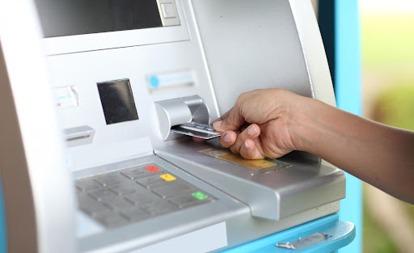

. . .

## Metes el pin

. . .

## Y te llevas tu dinero

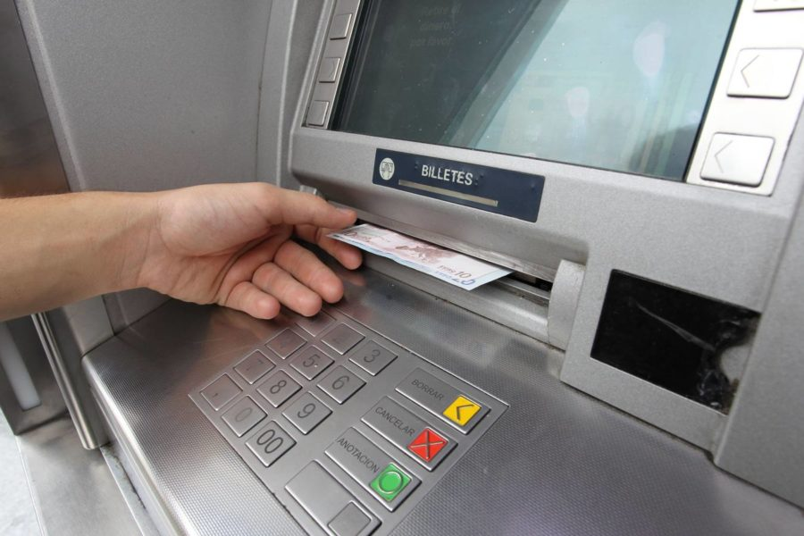

# Un ritual habitual

Este ha sido un ejemplo de

. . .

Identificación,

. . .

autentificación,

. . .

y autorización.

# ¿Qué es la identificación?

. . .

Es el proceso en el que una persona reconoce ser ella misma.

## Sistemas de login tradicionales

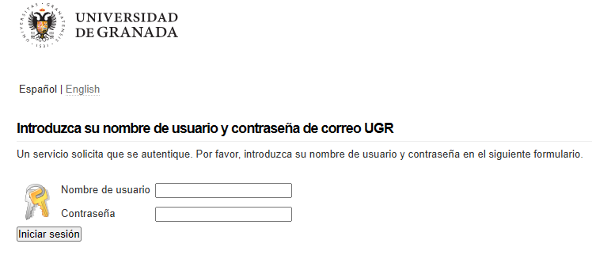

Hasta ahora, solíamos usar correo o usuario y contraseña.

## En la práctica, no es suficiente

. . .

¿Podría suplantarnos alguien?

. . .

¿Y qué ocurre si se filtran?

. . .

## Leak de Adobe...

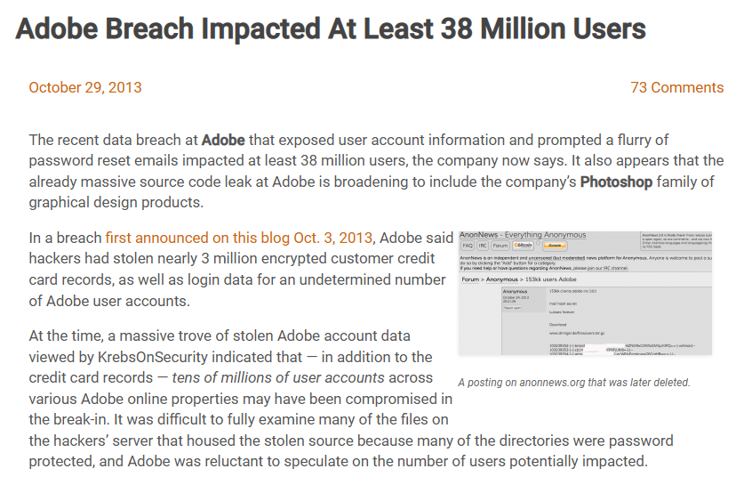

. . .

## ... de Yahoo...

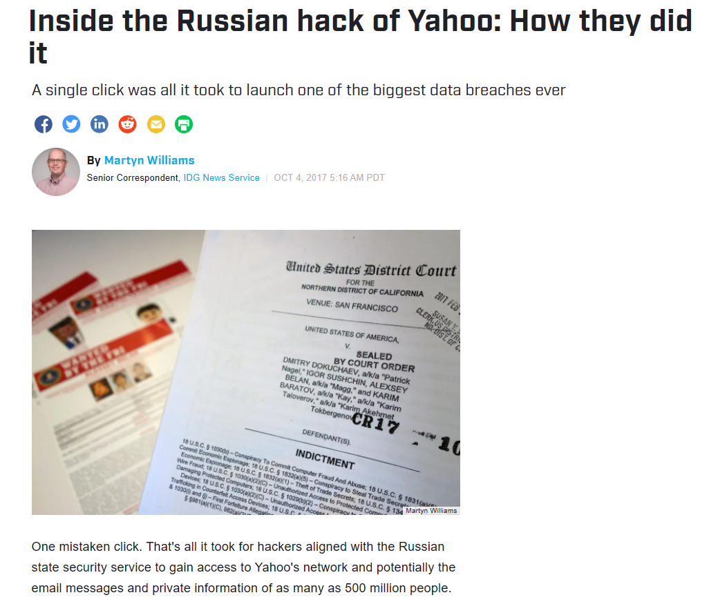{width="75%"}

. . .

## ... de Twitch...

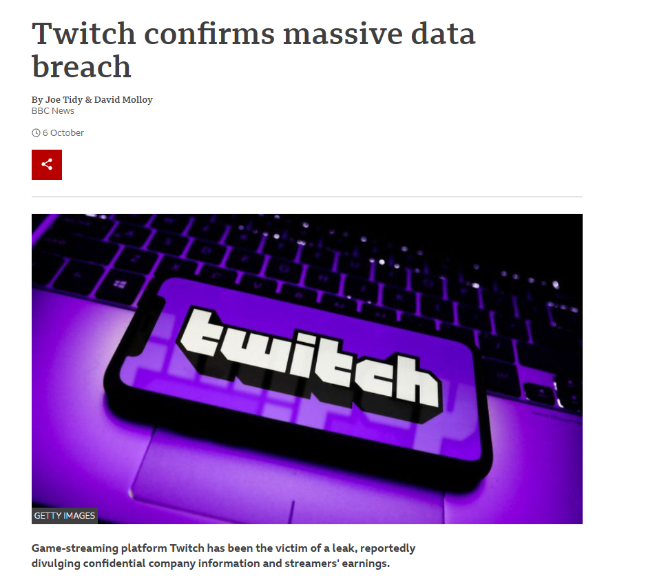{width="75%"}

. . .

## ... Y, cómo no, de Facebook.

{width="75%"}

# Una identidad digital para la nueva era

Necesitamos una forma de identificarnos fielmente en internet.

## Identidades digitales

. . .

Es toda la información disponible online de un agente externo (como una persona, organización o dispositivo electrónico).

. . .

ISO/IEC 24760-1 define una identidad como *conjunto de atributos relacionados con una entidad*.

## Certificados digitales

Las identidades digitales se representan mediante certificados digitales, como si fueran pasaportes.

. . .

Contienen información relacionada con la persona, y son emitidos por una **autoridad de certificación**.

# Las galletas de internet

{width="58%"}

## Los servidores no crecen en los árboles

Mantener un servicio cuesta dinero. Pero rara vez el usuario paga directamente.

. . .

¿Cómo se costea entonces la infraestructura?

## La publicidad

Las empresas pagan a las páginas para mostrar su publicidad.

. . .

Con el tiempo, se dieron cuenta de que podrían afinar el público objetivo.

. . .

Nacen así las cookies de seguimiento.

## Identidades y cookies

Las cookies de seguimiento son una forma de observar a un usuario. Las empresas de publicidad crean un perfil basándose en tus datos de navegación.

. . .

Así, consiguen rastrearte y aprender sobre tus intereses.

## Oye, ¿pero esto no es muy abusivo?

. . .

## Sí.

. . .

Y así lo cree también la Unión Europea.

. . .

La GPDR entró en vigor en el año 2018. Fuerza a las páginas web a pedirte consentimiento para que tus datos sean analizados.

. . .

Es una forma de proteger al usuario.

## Aunque eso signifique molestos banners.

{width="60%"}

. . .

Ugh.

# La comunidad al rescate

## Extensiones

Se han lanzado varias extensiones para protegernos de la publicidad y el seguimiento.

Algunos ejemplos son

. . .

## uBlock Origin

. . .

## Privacy Badger

# Un arma de doble filo

La identificación es un bien necesario...

. . .

... Pero algunas personas se han intentado aprovechar de la capacidad de identificar a usuarios online.

# Necesitamos métodos más robustos

Más tarde exploraremos cómo se debe hacer.

. . .

*Spoiler: la autentificación ayudará mucho.*

# ¿Qué es la autentificación?

# La cosa se complica

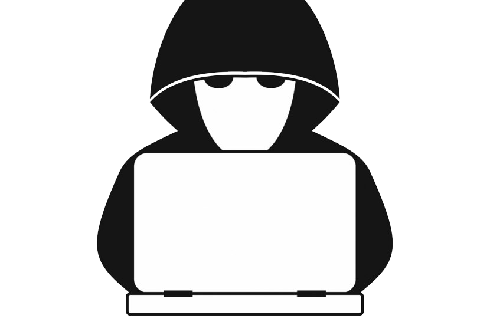

# ¿Cómo lo hacemos?

Factores de autentificación:

* Algo que eres
* Algo que sabes
* Algo que tienes

## Algo que eres

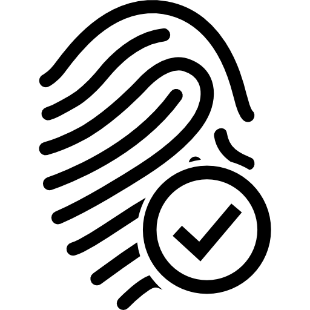

## Algo que sabes

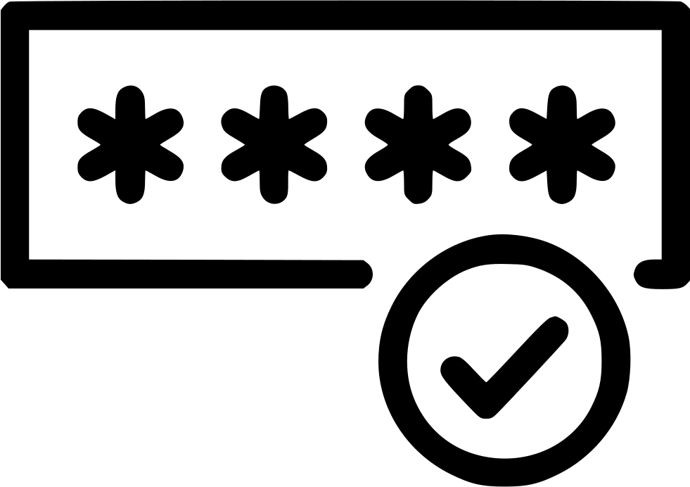

## Algo que tienes

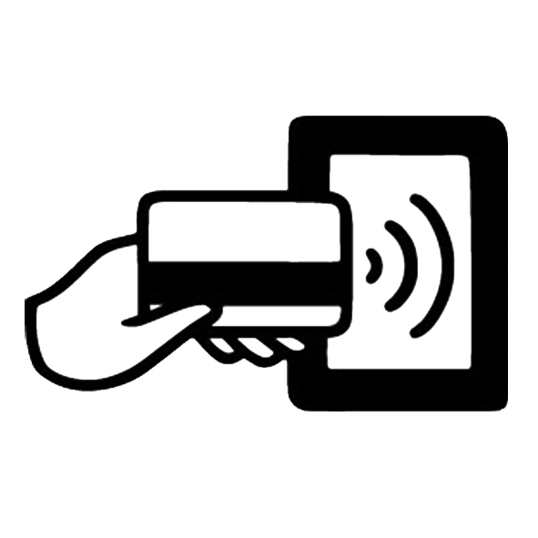

# Métodos modernos

. . . 

@. Integridad

. . .

@. Autenticación

. . .

@. Confidencialidad

. . .

## MAC

## Cifrado de llaves

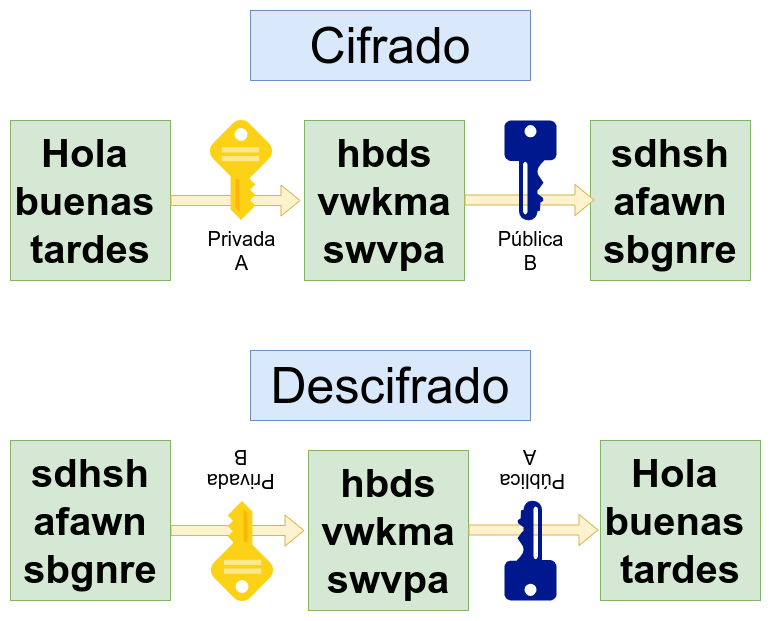{width="70%"}

## Firma digital

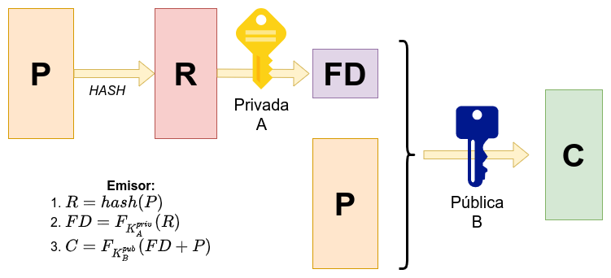{width="45%"}

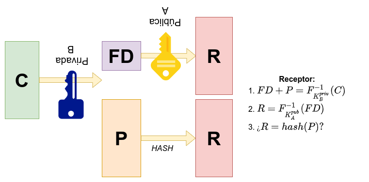{width="45%"}

# Otros métodos

. . .

Control de accesos

. . .

Verificación en dos pasos

. . .

OAuth

. . .

Biometría

. . .

## Control de accesos

Métodos hardware y software

::: columns

:::: {.column width="50%"}

::::

:::: {.column width="50%"}

::::

:::

## Verificación en dos pasos

Técnica de identificación cuya idea básica es añadir un paso más a las técnicas de verificación usuales.

## OAuth

OAuth es un estándar abierto que permite la autorización segura mediante el uso de un API

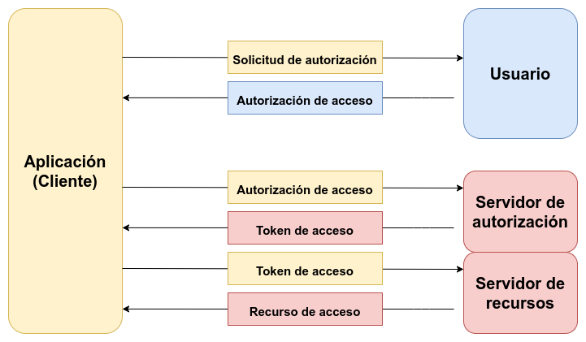

## Biometría

La biometría es la identificación automática de los individuos en función de sus características biológicas.

{width="70%"}
