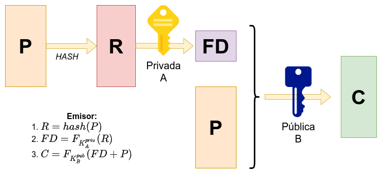

# Autentificación e identificación

## Guion

Deberíamos hablar de las siguientes cosas:

## Introducción
- Ejemplo: cajero. Introduces tarjeta (identificación). Cuando quieres hacer operaciones, metes el pin (autentificación).

## ¿Qué es la identificación?
### Bases
- Qué es identificar (https://www.wikiwand.com/en/Digital_identity)
  - Introducir credenciales y comprobar que existen.
  - spsi_slides, 340
### Formas de identificarse
### Problemas de la identificación por sí sola
- Problema: quién nos asegura que es quien dice ser? [*A critical problem in cyberspace is knowing with whom one is interacting. Using static identifiers such as password and email there are no ways to precisely determine the identity of a person in digital space, because this information can be stolen or used by many individuals acting as one.*](https://www.wikiwand.com/en/Digital_identity#/Background) (Enlazar con la autentificación.).
- (spsi_slides, 340)

## ¿Qué es la autentificación?
- Qué es autentificar == autenticar
  - El usuario es quien dice ser. No repudio (o no rechazo)
  - Autenticidad (spsi_slides, 140)
### Métodos
- Tipos de métodos (https://www.wikiwand.com/en/Authentication), (https://www.redeszone.net/tutoriales/seguridad/diferencias-autenticacion-autorizacion/)
### Factores
- Tipos de factores (https://www.wikiwand.com/en/Authentication#/Authentication_factors)

## Métodos modernos de autentificación e identificación

### MAC
La autenticación de un mensaje tiene como objetivo autentificar el origen del mismo y garantizar, al mismo tiempo, la integridad. La **integridad** consiste en asegurarse de que una información no ha sido modificada por terceros y que en caso de haberlo sido se detecte. La técnica más común son los servicios conocidos como **MAC** (“Message Authentication Code”), que se pueden expresar como función del mensaje $M$ que se quiere enviar y la clave compartida entre emisor A y receptor B, $K_{AB}$, de forma que
$$
MAC(M) = F(K_{AB} , M)
$$

El proceso es el siguiente:

1. Dado un mensaje $M$ y una clave compartida $K$, un algoritmo MAC permite derivar un código identificativo de $M$.
2. Este código se envía junto al mensaje original de forma que:
   - Un hipotético receptor calcula el código MAC del mensaje recibido.
   - Si coincide con el recibido junto a M, se determina la integridad del mensaje.

  
La función $F$ puede referirse a técnicas de cifrado como el AES o el RSA, pero es más usual el empleo de funciones compendio, resumen o hash, caracterizadas por:
- Ser sencillas de calcular.
- Proporcionan un mensaje de salida de longitud fija.
- Dos mensajes distintos proporcionan salidas distintas.
- Es imposible obtener el mensaje a partir de su compendio.

Esta variante es conocida como *HMAC*. Otra variante estándar es el *CBC-MAC*, basado en criptosistemas simétricos.

Esta técnica es utilizada en el protocolo TLS. Este es un protocolo criptográfico que proporciona comunicaciones seguras en una red, normalmente Internet. TLS utiliza MAC como técnica de seguridad en una fase previa de intercambio de llaves entre el cliente y el servidor, conocida como 'handshake' y  numerando y cifrando los registros de información transferida con MAC. 

### Firma digital

Todas las técnicas de cifrado no tendrían sentido si la comunicación se realiza con un usuario no autorizado. Por ello se necesitan técnicas para validar la identidad del interlocutor. Al margen de la autenticación MAC, un sistema simple basado en técnicas de cifrado de clave secreta es el denominado **reto-respuesta**. En él, dada una pareja emisor-receptor, A-B, y la clave entre ellos compartida $K_{AB}$ , los pasos seguidos son:
1. A contacta con B indicándole su deseo de comunicación.
2. B responde enviando un reto, $R_B$ , consistente en un número aleatorio que A debe devolver cifrado.
3. A cifra el reto usando la clave compartida $K_{AB}$.
4. Para identificar a B, A también enviará un reto $R_A$, que B debe devolver cifrado con $K_{AB}$.
5. Si ambos determinan que el cifrado es correcto, se da por válida la autenticación y por iniciada la comunicación.

La privacidad del mensaje queda garantizada, según vimos, sin más que A cifre la información con la clave pública de B, ya que solo este, a través de su clave privada, podrá acceder al mensaje original. Como se muestra en la Imagen 10, para
proporcionar autenticación además de privacidad, bastará con que A, previamente al cifrado con la clave pública de B que garantiza la confidencialidad, cifre el mensaje haciendo uso de su propia clave privada. Así, B, tras recibir el mensaje cifrado y descifrarlo con su clave privada, comprobará que el emisor es A al descifrar en una segunda etapa con la clave pública de este.

De esta forma el emisor «firma» el mensaje enviado de tal forma que, no pudiendo haber sido generado por nadie más, el emisor no pueda repudiar el mensaje transferido. Por analogía con las firmas manuscritas, este tipo de mecanismos de no repudio se conocen como **firma digital**.

Al igual que sucede con la autenticación, el no repudio puede proporcionarse mediante el empleo de técnicas de cifrado, tanto de clave secreta como de clave pública. En el caso de las primeras, se suele recurrir a una entidad central, referida como **Big Brother** (BB), de acuerdo al siguiente procedimiento:

1. Supuesto que A desea contactar con B, el primero envía su identidad a BB. Además, cifrado con la clave que con él comparte, $K_A$, le comunica la identidad de B y el mensaje a transmitir a este, $P$. Adicionalmente puede incluirse una marca de tiempo ($t$).
2. Recibida esta solicitud de envío, BB transmitirá a B, cifrado todo con la clave secreta compartida entre ambos, $K_B$, la identidad de A, el mensaje $P$, un sello de tiempo $t$ y la firma digital de BB. La firma digital de BB consiste en los tres primeros elementos antes mencionados cifrados con una clave privada particular de BB, $K_{BB}$, de modo que solo él puede descifrar la información.

La firma digital es la prueba que puede presentar B en una hipotética demanda judicial por parte de A. Así, demostrado el mensaje transferido, la fecha y la identidad del emisor, el caso quedará legalmente zanjado.

En el caso de las técnicas de cifrado de clave pública, la generación de firmas digitales sigue el mismo proceso que el descrito para proporcionar autenticación (imagen 10). El descifrado del mensaje recibido con la clave pública del emisor basta para demostrar que aquel solamente pudo ser generado por este. El conjunto de procesos seguidos en una comunicación entre un emisor A y un receptor B en la que se intercambian un mensaje $P$ mediante un esquema de firma digital es el siguiente:
1. Obtención del resumen del mensaje : $R = hash(P)$.
2. Cifrado (función de cifrado $F$) del resumen con la clave privada de A, $K_{A}^{priv}$ esto constituye la firma digital en sí: $FD = F_{K_{A}^{priv}}(R)$.
3. El mensaje cifrado finalmente transmitido hacia B, $C$, consistirá en la firma digital, $FD$, más el mensaje, $P$, todo cifrado con la clave pública de B, $K_{B}^{pub}$ para garantizar la confidencialidad del mensaje. O sea, $C = F_{K_{B}^{pub}}(FD + P)$.

Recibido $C$ en el receptor, este procederá como sigue:

1. Obtención de la firma digital y el mensaje descifrando $C$ con la clave privada propia: $FD + P = F_{K_B^{priv}}^{-1}(C)$.
2. Obtención del resumen de $P$ tras descifrar $FD$ con la clave pública de A, $R = F^{-1}_{K_A^{pub}}(FD)$.
3. Como $P$ es conocido desde el primer paso, se le calcula a este el compendio y debe coincidir con el obtenido en el paso 2, en ese caso la comunicación se da por válida.

Mediante este uso de esquemas de firma digital basados en funciones hash se cubre no solo el no repudio, sino también:
- **Confidencialidad**: Mediante el uso de RSA con la clave pública del receptor.
- **Integridad**, ya que el resumen es único para cada mensaje.
- **Autenticación**, al cifrar la clave privada del emisor para cifrar mediante RSA el mensaje transmitido.

### (Renombrar esta sección)
#### Control de accesos

Los primeros elementos para prevenir accesos no autorizados a la red son establecer medidas para controlar dicho acceso y determinar la autenticidad de las entidades. Estudiaremos ahora algunas técnicas hardware y software para garantizar dicho acceso.

Sobre las técnicas hardware, una de las alternativas es el uso de terminales de acceso, que son dispositivos que se encargan de la autenticación y la verificación de la persona que los usa. Pueden incluir verificación por huellas dactilares y sensores anti-rotura en tiempo real, y funcionar en línea o en solitario. Otra alternativa es la monitorización visual, incluyendo el uso de imágenes y audio en tiempo real junto con tecnologías de localización tipo GPS.

También podemos considerar el control mediante tarjetas de identificación, con la vulnerabilidad de que en caso de hurto o pérdida algún agente externo puede hacerse pasar por el propietario de la tarjeta; identificación biométrica, de la que hablaremos más adelante, o video-vigilancia mediante el análisis de imágenes de video en circuito cerrado, permitiendo una respuesta casi en tiempo real.

Por otro lado, mediante software, existen aplicaciones que monitorizan las actividades personales y almacenan eventos relacionados con el acceso. Algunos ejemplos de aplicaciones de monitorización de accesos son [PRTG](https://www.paessler.com/es/prtg), [Nagios Network Analyzer](https://www.nagios.com/products/nagios-network-analyzer/) o [Pandora FMS](https://pandorafms.com/es/). Tienen la ventaja de que se puede emplear fácilmente en modo remoto utilizando técnicas de reconexión automática o presentación de informes regularmente en terminales conectados de varias maneras. 

#### Verificación en dos pasos

La verificación en dos pasos, en inglés '*two-factor authentication*' y popularmente conocida como *2FA* es una técnica de identificación cuya idea básica es añadir un paso más a las técnicas de verificación usuales. Para clarificar, nos centraremos en el caso de iniciar sesión en distintas plataformas, de hecho la verificación en dos pasos es usada en servicios como Google, Facebook, Twitter o Instagram.

Tradicionalmente siempre ha bastado con proporcionar usuario y contraseña para iniciar sesión, pero desde hace pocos años hay una tendencia a incluir un paso más, como puede ser introducir un código enviado por SMS, confirmar el inicio de sesión desde un e-mail o una notificación en el teléfono móvil. A este segundo paso es al que nos referimos en la 2FA. La motivación de introducir este método es que a veces puede haber filtraciones de contraseñas en Internet o alguien puede adivinar tu contraseña porque es muy sencilla (fecha de nacimiento, nombre de una mascota, etc.). Por eso, cuando se escriba nombre y contraseña correcto, es bueno tener una manera de confirmar que quien lo está escribiendo es la persona correcta.

La manera de hacerlo es añadir un segundo paso en el proceso de identificarte en un servicio. De esta manera, al escribir correctamente nombre de usuario o correo electrónico junto a la contraseña, el servicio pedirá un segundo paso. Por tanto, la 2FA sirve para evitar que otras personas puedan acceder a una cuenta, incluso en el caso de que hayan conseguido averiguar la contraseña utilizada de alguna manera. De esta forma, incluso si se roban las credenciales siempre quedará ese segundo paso en el que el propietario de la cuenta tiene que verificar el inicio de sesión.

Hay muchos métodos de verificación en dos pasos, algunos de los más populares y conocidos son las ya mencionadas verificación por SMS o correo electrónico, pregunta de seguridad, aplicaciones de autenticación, códigos en la propia aplicación, llaves de seguridad, biometría o códigos de recuperación.

#### OAuth

Cada vez más páginas webs, foros, blogs, tiendas etc. nos piden que nos registremos rellenando una y otra vez para cada sitio web todos nuestros datos. Gracias a Open Authorization (OAuth) nos podemos olvidar de tener que registrarnos una y otra vez en cada uno de los servicios que utilicemos, ya que, con un solo registro, podríamos iniciar sesión muy fácilmente en diferentes webs, sin necesidad de compartida toda nuestra identidad digital.

A día de hoy muchas plataformas, como Instagram o Spotify, permiten iniciar sesión utilizando nuestra cuenta de Facebook o de Google, ahorrandonos el tiempo de rellenar el formulario que ya rellenamos cuando nos registramos en estas últimas y facilitando el proceso de registro. OAuth es un estándar abierto que permite la autorización segura mediante el uso de un API. En la actualidad se usa desde octubre de 2012, en su versión OAuth 2.0.

Definimos algunos roles importantes para poder entender su funcionamiento:

- **Cliente**: Es la aplicación que quiere acceder a la cuenta de usuario de un determinado servicio, como Facebook, Twitter, Google, etc.
- **Usuario**: Es quien autoriza a la aplicación a acceder a su cuenta, mediante una ventana emergente que pide autorización, y normalmente se incluye información sobre los datos que se van a compartir al servicio nuevo. 
- **Servidor de autorización**: recibe las peticiones de acceso de aplicaciones que desean usar el inicio de sesión. Este servidor se encarga de verificar la identidad del usuario y del servicio que solicita acceso, permitiendo o denegando el acceso.

Veámoslo de forma conjunta, los pasos que sigue OAuth son:
1. La aplicación solicita autorización para acceder a los datos de usuario mediante el uso de alguno de los servicios que lo permiten. 
2. Si el usuario autoriza la solicitud, la aplicación recibe una autorización de acceso.
3. El cliente tiene que validar la autorización correctamente con el servidor.
4. Si es así, el servidor emite un token para la aplicación que solicitaba acceso para que pueda acceder. 

En caso de que, en algún paso, el usuario deniegue el acceso o el servidor detecte algún tipo de error, la aplicación no podrá acceder y mostrará un mensaje de error.

#### Biometría

La biometría es la identificación automática de los individuos en función de sus características biológicas. La biometría se basa en el reconocimiento de una característica física e intransferible de las personas, como retina, huellas dactilares, palma de la mano, etc. A grandes rasgos, se compara la imagen obtenida mediante un escáner o similar con una base de datos almacenada en el sistema.

Es tal la importancia de la biometría en la actualidad, que España ocupa el tercer lugar de la Unión Europea en empresas que la usan para identificarse. En concreto, el 20% de las compañías españolas lo hicieron en 2019, según [Eurostat](https://ec.europa.eu/eurostat/web/products-datasets/-/isoc_cisce_ra). 

El principal uso de la biometría es la autenticación del usuario para probar su intervención en cualquier proceso o para tener acceso a determinada información o servicio. Uno de ellos es la firma digital de documentos, en este caso no mediante un par de claves pública o privada como se ha explicado anteriormente, sino mediante lo que definimos como **firma biométrica**.

La firma biométrica añade evidencias físicas e irrefutables para crear una firma digital válida en todos los aspectos. Mediante este recurso, se registran diversos factores biológicos y físicos que identifican al firmante. Podemos aplicar este concepto en la verificación en dos pasos ya comentada, pudiendo combinar factores biométricos con otros que no lo son. Así, podemos utilizarlos conjuntamente con una contraseña o un código de un sólo uso (OTP), por mencionar algunos.

La firma biométrica es un recurso verdaderamente práctico para la protección de la identidad digital. Es imposible duplicar una huella dactilar o un iris, o imitar a la perfección una voz o la forma de realizar una firma manuscrita sobre una pantalla. Esto hace que [la firma biométrica sea prácticamente infalsificable](https://www.viafirma.com/blog-xnoccio/es/falsificar-firma-digital/).

## Bibliografía

[1](https://www.tecnomental.com/seguridad-informatica/identificacion-y-autenticacion-que-es/)

https://security.stackexchange.com/questions/109131/how-and-when-is-a-mac-sent-across-during-a-tls-connection

https://es.wikipedia.org/wiki/Seguridad_de_la_capa_de_transporte

https://www.masscomm.es/blog/tipos-de-terminales-de-control-de-acceso-cual-utilizar

https://geekflare.com/es/network-monitoring-software/#anchor-prtg

https://www.xataka.com/basics/verificacion-dos-pasos-2fa-que-sirve-que-metodos-existen

https://www.redeszone.net/tutoriales/seguridad/que-es-oauth/

https://oauth.net/2/

https://en.wikipedia.org/wiki/OAuth

https://www.viafirma.com/blog-xnoccio/es/que-es-biometria/

